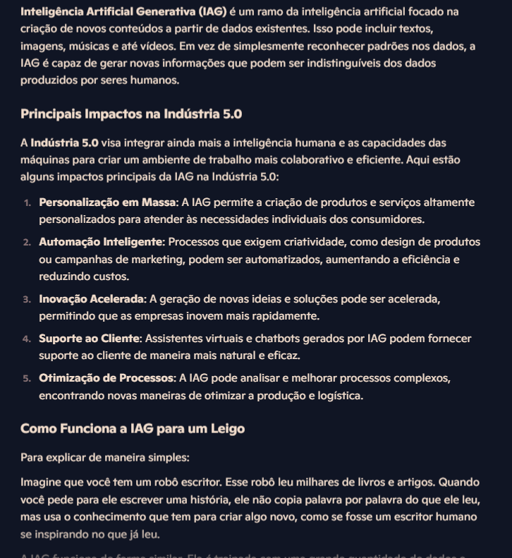
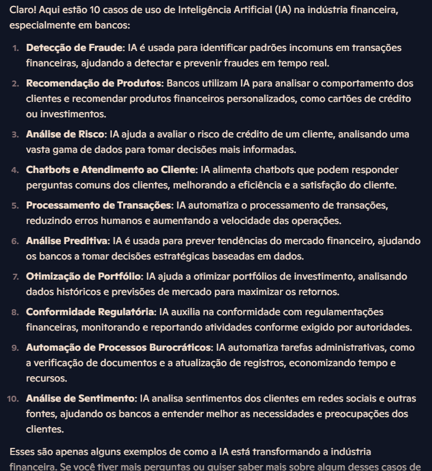

# EXPLORANDO RECURSOS DO COPILOT IA

#### Este projeto faz parte do programa Bootcamp Microsoft Copilot AI da DIO


<p>Copilot é um assistente virtual inteligente de chatbot   
 O Copilot é uma ferramenta multifuncional de IA que se integra perfeitamente a várias plataformas e aplicativos da Microsoft. Ela é uma IA generativa e tem a capacidade de gerar imagens, conteúdos textos</p>

## Proposta Desafio [DIO.me](https://web.dio.me/lab/explorando-os-recursos-de-ia-generativa-com-copilot-e-openai/learning/1a2619f1-4d92-435a-b010-3baef67cae55?back=/play)

> Explorando alguns conceitos estudados do Copilot Ai na prática. 

## Tarefas

O projeto desenvolvido tem as seguintes tarefas:

- [x] Crie um novo repositório no github.
- [x] Crie uma pasta chamada 'inputs' e salve as imagens dos `<prompts>`
- [x] Crie uma pasta chamado 'output' e salve os resultados de reconhecimento dos `<prompts>` nessas imagens.
- [x] Crie um arquivo chamado readme.md.
- [x] Compartilhe o link desse repositório.

## Usando o Copilot AI

Prompt 01:

```
Descreva o que é Inteligência Artificial Generativa (IAG), liste seus principais impactos na indústria 5.0 e explique como a IAG funciona para um leigo.
```


### Resposta 




Prompt 02:

```
Liste e explique 10 casos de uso de aplicação de IA na indústria financeira, neste caso os bancos.
```


### Resposta 




## Conclusão 

<p> O Microsoft Copilot entende a linguagem natural (LLM), sem problemas. Mas utilizar corretamente as instruções básicas quando se interage com agentes virtuais pode melhorar a qualidade das interações individuais, assim como para alcançar a eficácia esperada na implementação dessa tecnologia no ambiente empresarial ou acadêmico.</p>

## Licença

Esse projeto está sob licença. Veja o arquivo [LICENÇA](LICENSE.md) para mais detalhes.